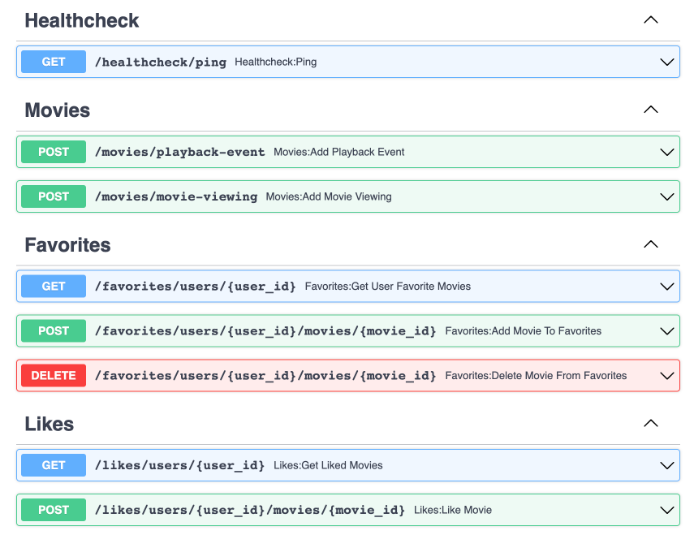
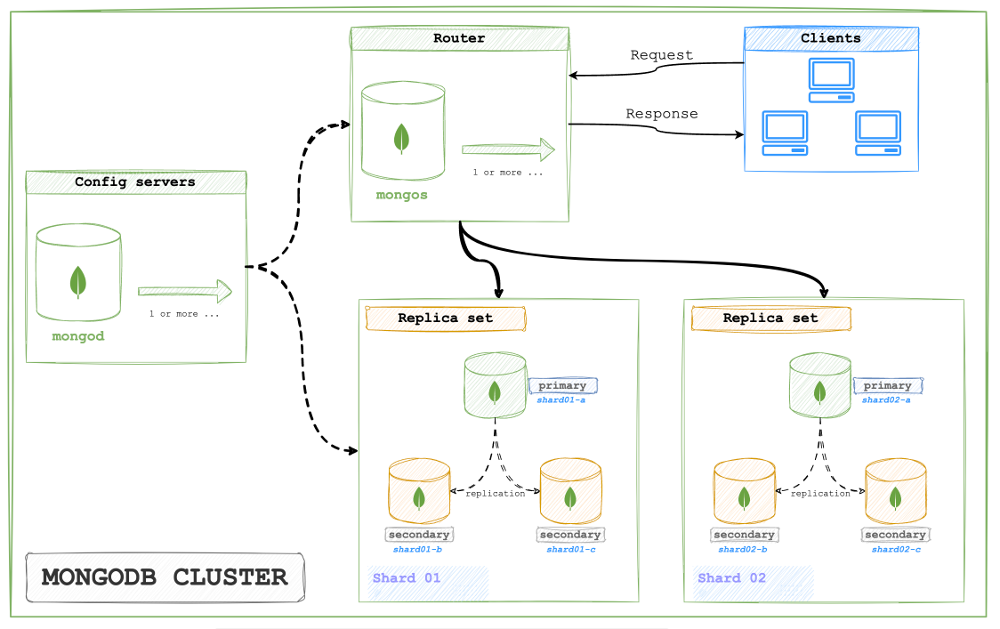
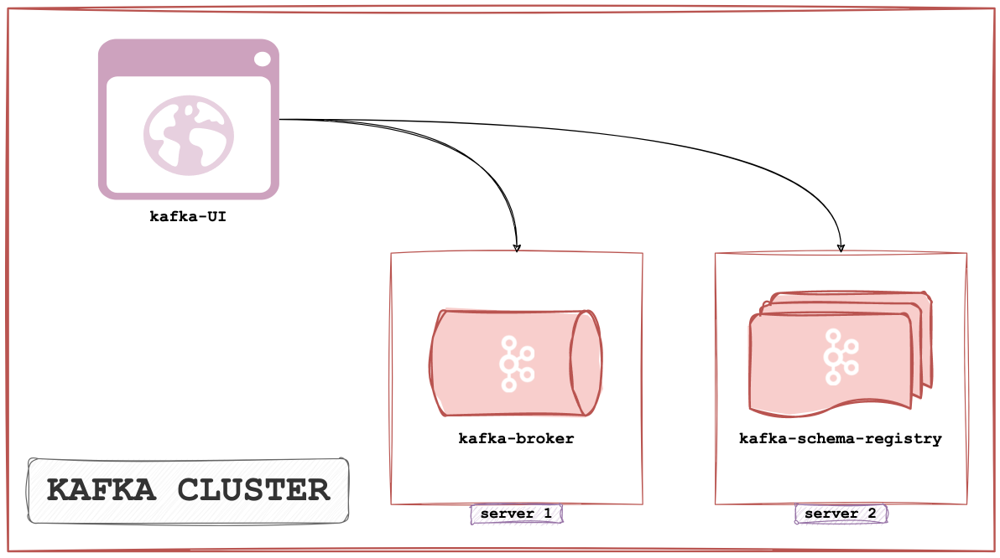
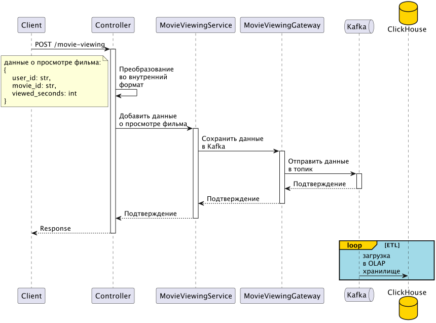
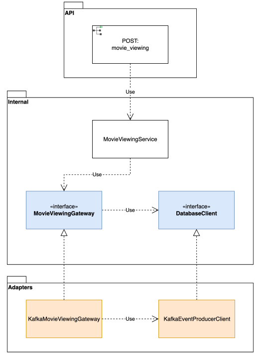
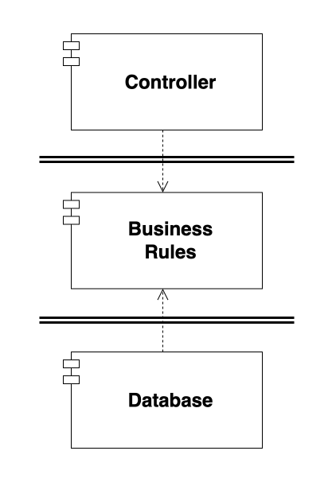

<a href="https://www.mongodb.com/docs/" target="_blank">
    
</a>
<a href="https://www.mongodb.com/docs/" target="_blank">
    
</a>
<a href="https://hub.docker.com/r/bitnami/kafka" target="_blank">
    
</a>
<a href="#">
    
</a>
<a href="https://black.readthedocs.io/en/stable/">
    
</a>


# UGC-movies

UGC-movies - сервис генерации контента для [Онлайн кинотеатра "Movies"](https://github.com/xczdenis/movies).

Сервис предоставляет возможность обрабатывать огромное количество данных, генерируемых пользователями
онлайн-кинотеатра. Например, данные о поведении пользователя во время просмотра фильма. Также это могут быть
лайки, добавление в избранное, оценка фильма и т.д. На основании этих данных можно строить рекомендательную
систему.

Благодаря [Kafka](https://kafka.apache.org/), сервис способен обрабатывать огромное количество запросов в
секунду. Данные хранятся в [ClickHouse](https://clickhouse.tech/) - OLAP хранилище, это позволяет мгновенно
выполнять сложные аналитические запросы. Данные о лайках и избранном хранятся в
[MongoDB](https://www.mongodb.com/), что позволяет быстро выполнять запросы к данным и масштабировать
хранилище горизонтально без предела.


## 📖 Содержание
- [🌟 Особенности](#-Особенности-)
- [✅ Функционал сервиса](#-Функционал-сервиса-)
- [📦 Компоненты системы](#-Компоненты-системы-)
    - [🍔 Кластер MongoDB](#-Кластер-MongoDB-)
    - [🍔 Кластер Clickhouse](#-Кластер-Clickhouse-)
    - [🍔 Кластер Kafka](#-Кластер-Kafka-)
- [🛁 Чистая архитектура](#-Чистая-архитектура-)
- [🚀 Быстрый старт](#-Быстрый-старт-)
    - [⚙️ Настройка переменных окружения](#-Настройка-переменных-окружения-)
    - [🏁 Запуск проекта](#-Запуск-проекта-)
- [👉 Режим разработки](#-Режим-разработки-)
    - [📚 Pre requirements](#-pre-requirements-)
    - [🛠️ Создание среды разработки](#-Создание-среды-разработки-)
    - [🌍 Переменные окружения](#-Переменные-окружения-)
    - [📖 Установить Poetry](#-Установить-Poetry-)
    - [🐳 Подробнее про Docker](#-Подробнее-про-Docker-)
    - [🔄 Режимы запуска](#-Режимы-запуска-)
    - [📄 Один Dockerfile для двух режимов](#-Один-Dockerfile-для-двух-режимов-)
    - [🔑 Essential services](#-essential-services-)
    - [🏁 Запуск проекта в докере](#-Запуск-проекта-в-докере-)
    - [🔧 Полезные команды](#-Полезные-команды-)
    - [💻 Локальный запуск](#-Локальный-запуск-)
- [👉 Особенности разработки](#-Особенности-разработки-)
    - [🔗 Управление зависимостями](#-Управление-зависимостями-)
    - [📝 Conventional Commits](#-conventional-commits-)
    - [🖥️ Настройки IDE](#-Настройки-IDE-)
    - [✨ Форматер и линтер](#-Форматер-и-линтер-)


## 🌟 Особенности [🔝](#-содержание)

<ul>
<li>Работает с <b>Python 3.11</b>;</li>
<li>Полностью асинхронный;</li>
<li><b>ClickHouse кластер</b> - OLAP хранилище. Легко настраиваемый конфиг кластера;</li>
<li><b>Kafka кластер</b> - обработка потоковых данных:</li>
<ul>
    <li><b>aiokafka</b> - асинхронная работа с kafka;</li>
    <li><b>schema_registry</b> - централизованное хранилище и валидация схем kafka;</li>
    <li><b>kafka-ui</b> - веб-интерфейс для кластера kafka;</li>
</ul>
<li><b>Непрерывный ETL</b> процесс из Kafka в ClickHouse</li>
<li><b>MongoDB кластер</b> - отказоустойчивый, масштабируемый кластер для хранение данных о лайках и избранном;</li>
<li><b>FastAPI</b> - быстрый и современный фреймворк для создания API;</li>
<li><b>Nginx</b> - веб-сервер для обработки запросов к API;</li>
<li><b>Python инитеры</b> - python-код для автоматической инициализации всех кластеров:</li>
<ul>
    <li>Clickhouse initer;</li>
    <li>Kafka initer;</li>
    <li>Mongo initer;</li>
</ul>
<li>Полная интеграция с <b>Docker</b>:</li>
<ul>
    <li>Docker-compose для локальной разработки;</li>
    <li>Тесты в Docker;</li>
    <li>Тонкие образы, благодаря multi-stage сборке;</li>
</ul>
<li><b>Makefile</b> - удобный интерфейс для запуска команд проекта;</li>
<li><b>Pre-commit hooks</b> - автоматическая проверка кода перед коммитом для соблюдения стандартов разработки;</li>
<li><b>Conventional commits</b> - стандарт для написания коммитов;</li>
<li>Применение <b>SOLID принципов</b>.</li>
</ul>


## ✅ Функционал сервиса [🔝](#-содержание)

Сервис предоставляет следующий функционал:
1. Фиксация события, произошедшего во время просмотра фильма (начало просмотра, пауза, перемотка вперед,
назад, остановка);
2. Фиксация текущей позиции воспроизведения фильма;
3. Добавление времени просмотра фильма для построения рекомендательной системы;
4. Добавление фильма в избранное. Получение списка избранных фильмов;
5. Оценки фильмов.

Подробную документацию API можно посмотреть по адресу: [http://127.0.0.1:8000/api/v1/openapi/](http://127.0.0.1:8000/api/v1/openapi#/)




## 📦 Компоненты системы [🔝](#-содержание)


### 🍔 Кластер MongoDB [🔝](#-Компоненты-системы-)

Кластер MongoDB реализован по [P-S-S архитектуре](https://www.mongodb.com/docs/manual/core/replica-set-architecture-three-members/#primary-with-two-secondary-members--p-s-s-)
(Primary with Two Secondary Members).

<ul>
<li>Config Server (1 сервер): mongo-configsvr01</li>
<li>2 шарда (на каждом реплика-сет из 3х реплик):</li>
<ul>
    <li>mongo-shard01-a, mongo-shard01-b, mongo-shard01-c</li>
    <li>mongo-shard02-a, mongo-shard02-b, mongo-shard02-c</li>
</ul>
<li>Router (1 сервер): mongo-router01</li>
</ul>




### 🍔 Кластер Clickhouse [🔝](#-Компоненты-системы-)

Кластер Clickhouse реализован с [Clickhouse keeper](https://clickhouse.com/docs/en/guides/sre/keeper/clickhouse-keeper) -
встроенный в Clickhouse механизм, который предоставляет систему координации репликации данных и выполнения
распределенных DDL- запросов. Аналог ZooKeeper.

<ul>
<li>2 шарда по 2 реплики на каждом. Одна из реплик содержит keeper.</li>
<li>Шард 1:</li>
<ul>
    <li>clickhouse-shard1: c keeper;</li>
    <li>clickhouse-shard1-replica1: без keeper;</li>
</ul>
<li>Шард 3:</li>
<ul>
    <li>clickhouse-shard2: c keeper;</li>
    <li>clickhouse-shard2-replica1: без keeper;</li>
</ul>
<li>clickhouse-keeper-quorum: нода без базы данных, только с keeper для достижения кворума при голосовании.</li>
</ul>


### 🍔 Кластер Kafka [🔝](#-Компоненты-системы-)

Кластер Kafka состоит из 1 сервера для `kafka broker`, 1 сервера для `schema-registry` для хранения и
валидации схем топиков и сервера для UI интерфейса.




## 🛁 Чистая архитектура [🔝](#-содержание)

Сервис построен на основе принципов чистой архитектуры. Бизнес-логика оперирует абстракциями и отделена
от конкретных реализации таких как базы данных.

Например, рассмотрим, процесс добавления данных о времени, потраченном пользователем на просмотр
фильма. Диаграмма последовательности процесса представлена ниже:



Разберем участников процесса:
1. `Controller` - ендпоинт, обрабатывающий запрос от клиента;
2. `MovieViewingService` - выполняет бизнес логику;
3. `MovieViewingGateway` - шлюз данных. Это интерфейс, предоставляющий методы работы с базой данных.
Весь код на языке запросов для конкретной базы данных должен находиться здесь;
4. `KafkaMovieViewingGateway` - конкретная реализация шлюза `MovieViewingGateway` для Kafka;
5. `DatabaseClient` - интерфейс, предоставляющий соединение с базой данных. Здесь присутствует метод `execute`,
который отправляет в базу данных запрос подготовленный в шлюзе `MovieViewingGateway`;
6. `KafkaEventProducerClient` - конкретная реализация интерфейса `DatabaseClient` для Kafka.

Диаграмма классов выглядит следующим образом:



Классы в пакете `Internal` реализуют бизнес логику приложения. Пакет `API` - это контроллер. Пакет
`Adapters` - это адаптеры для работы с конкретными системами.

Класс `MovieViewingService` использует интерфейс `MovieViewingGateway` для работы с базой данных.
Класс `KafkaMovieViewingGateway` реализует этот интерфейс и выполняет операции в фактической
базе данных `KafkaEventProducerClient`.

Если упростить диаграмму классов, то получим следующую картину:



Компонент `BusinessRules` - это высокоуровневые политики приложения, здесь хранится вся бизнес-логика
приложения. Компонент `Database` - это низкоуровневые политики, здесь хранится все, что связано с
конкретными системами, например, с конкретной базой данных.

Двойными линиями обозначены архитектурные границы. Направление стрелки указывает на то, что компонент
`Database` знает о существовании компонента `BusinessRules`. Компонент `BusinessRules` не знает о
существовании компонента `Database`. Это говорит о том, что интерфейс `MovieViewingGateway` находятся
в компоненте `BusinessRules`, а класс `KafkaMovieViewingGateway` - в компоненте `Database`.

Проведя границу между двумя компонентами и направив стрелку в сторону `BusinessRules`, мы видим,
что компонент `BusinessRules` мог бы использовать базу данных любого типа.
Компонент `Database` можно заменить самыми разными реализациями - для `BusinessRules` это совершенно неважно.
А это означает, что выбор базы данных можно отложить и сосредоточиться на реализации и тестировании
бизнес-правил.

Как видно из схемы, все стрелки (все зависимости) направлены внутрь - это доказывает соблюдение принципов
чистой архитектуры:
> Главным правилом, приводящим эту архитектуру в действие, является правило зависимостей
> (Dependency Rule): Зависимости в исходном коде должны быть направлены внутрь, в сторону высокоуровневых
> политик.
>
> _Clean Architecture: A Craftsman's Guide to Software Structure and Design (Robert C. Martin Series)_


## 🚀 Быстрый старт [🔝](#-содержание)

Все команды, приведенные в данном руководстве, выполняются из корневой директории проекта, если иное не
указано в описании конкретной команды.


### ⚙️ Настройка переменных окружения [🔝](#-Быстрый-старт-)

Создай файлы `.env` и `.env.local` в корне проекта, выполнив команду:
```bash
make env
```
Можно просто скопировать файлы `env.template` и `env.local.template`.


### 🏁 Запуск проекта [🔝](#-Быстрый-старт-)

🚨 Убедись, что у тебя свободны все следующие порты:
1. Все порты в `.env.local`;
2. Все порты раздела `Expose ports for clickhouse's nodes` в `.env`;
3. Порт `KAFKA_BROKER_EXPOSE_PORT` в `.env`.

🚨 Укажи свою платформу для docker образов в `.env`. Например, для Mac на M1 вот так:
```bash
DOCKER_IMG_PLATFORM=linux/arm64
```

Запустить проект в докере:
```bash
make run
```
Приложение будет доступно по адресу [http://localhost:8000](http://localhost:8000/api/v1/openapi).

Документация: [http://localhost:8000/api/v1/openapi](http://localhost:8000/api/v1/openapi).

Запустить проект локально (должны быть запущены все докер-контейнеры кроме `app`):
```bash
python src/movies_ugc/main.py
```

Запустить тесты в докере:
```bash
make test
```

Запустить тесты локально (должны быть запущены все докер-контейнеры):
```bash
make test-local
```


## 👉 Режим разработки [🔝](#-содержание)


### 📚  Pre requirements [🔝](#-Режим-разработки-)
Для успешного развертывания среды разработки понадобится:

1. Python ^3.11;
2. Менеджер пакетов [Poetry](https://python-poetry.org/docs/#installation);
3. Docker (version ^23.0.5). Если у тебя его еще нет, следуй [инструкциям по установке](https://docs.docker.com/get-docker/);
4. Docker compose (version ^2.17.3). Обратись к официальной документации [для установки](https://docs.docker.com/compose/install/);
5. [Pre-commit](https://pre-commit.com/#install).

Также будет полезным:

1. [Hadolint](https://github.com/hadolint/hadolint) - линтер докер файлов.


### 🛠️ Создание среды разработки [🔝](#-Режим-разработки-)

Перед выполнением команд из этого раздела, убедись, что у тебя установлены все компоненты [Pre requirements](#Pre-requirements-),
в противном случае, смотри инструкции по установке в подразделах ниже.

Для создания среды разработки, выполни следующие команды одну за другой, из корневой директории проекта:
```bash
make env
poetry shell
make init
```
Те же команды без `Makefile`:
```bash
cp .env.template .env
cp .env.local.template .env.local
poetry shell
poetry install
pre-commit install
pre-commit install --hook-type commit-msg
```


### 🌍 Переменные окружения [🔝](#-Режим-разработки-)

В проекте используются 2 файла с переменными окружения: `.env` и `.env.local`, для каждого из которых
есть соответствующие шаблоны: `env.template` и `env.local.template`.

Создай файлы `.env` и `.env.local` в корне проекта с помощью следующей команды:
```bash
make env
```
Файл `.env.local` необходим для локальной разработки. Значения переменных в этом файле переопределяют значения
переменных из файла `.env` при запуске приложений локально. Это полезно при разработке, когда
нужно запустить приложение на `localhost`, а не в контейнере и указать специфический порт для него.

Рассмотрим пример с переменными `APP_HOST` и `APP_PORT`. В файле `.env` указаны следующие значения:
```bash
APP_HOST=0.0.0.0
APP_PORT=8000
```
При запуске проекта в докере, приложение будет доступно на хосте `app` (поскольку имя сервиса в
`docker-compose.yml` указано как `app`) по порту `8000`.

В файле `.env.local` указаны следующие значения:
```bash
APP_HOST=localhost
APP_PORT=8000
```
При запуске проекта локально командой `python src/movies_ugc/main.py` приложение будет доступно на хосте
`localhost` по порту `8000`.

Отладчик в твоем любимом IDE также будет отлично работать.

Также ты можешь указать специфические порты для баз данных, если стандартные порты у тебя уже заняты.


### 📖 Установить Poetry [🔝](#-Режим-разработки-)
Подробнее про установку Poetry [здесь](https://python-poetry.org/docs/#installation).

**Linux, macOS, Windows (WSL)**
```bash
curl -sSL https://install.python-poetry.org | python3 -
```

**Важно:** после установки, необходимо добавить путь к Poetry в свой `PATH`. Как правило, это делается
автоматически. Подробнее смотри в разделе [Add Poetry to your PATH](https://python-poetry.org/docs/#installation).

Проверить, что Poetry установлен корректно:
```bash
poetry --version

# Poetry (version 1.4.0)
```


### 🐳 Подробнее про Docker [🔝](#-Режим-разработки-)

Запуск проекта выполняется с помощью docker-compose. Проект содержит следующие файлы docker-compose:

* **docker-compose.yml** - главный файл;
* **docker-compose.dev.yml** - содержит ***только изменения*** относительно главного файла, необходимые для режима разработки;
* **docker-compose.test.yml** - содержит ***только изменения*** для запуска тестов;

#### Файл docker-compose.yml [🔝](#-Режим-разработки-)
Файл `docker-compose.yml` - это главный compose-файл. Любая команда `docker-compose` должна использовать
этот файл в качестве первого аргумента.

Файл содержит все сервисы проекта (кроме тестовых) и основные метаданные для каждого сервиса,
такие как `build`, `env_file`, `depends_on` и т.п.

Файл `docker-compose.yml` **не должен** содержать разделов с монтированием томов (`volume`)
и указанием портов (`ports`), особенно здесь не должно быть портов, смотрящих наружу.

#### Профили [🔝](#-Режим-разработки-)
Все сервисы в файле `docker-compose.yml` сгруппированы по профилям. Профили необходимы для возможности
запуска только определенной группы сервисов.

Главный профиль - `default`, все сервисы должны иметь этот профиль.

Существуют следующие профили:
* `default`
* `olap`
* `oltp`
* `nosql`
* `api`

Например, к профилю `nosql` относятся только сервисы кластера `mongo` и больше ничего. Запустить исключительно
кластер `mongo` можно следующей командой:
```bash
make run-nosql
```


#### Файл docker-compose.dev.yml [🔝](#-Режим-разработки-)

Файл `docker-compose.dev.yml` используется для запуска проекта в режиме разработки. Здесь добавляются
изменения относительно `docker-compose.yml`. Например, здесь можно примонтировать тома для папок приложения
и указать порты, смотрящие наружу, чтобы облегчить отладку.


#### Файл docker-compose.test.yml [🔝](#-Режим-разработки-)

Файл `docker-compose.test.yml` содержит сервисы только для тестов. Этот файл используется для запуска
тестов в докере.


### 🔄 Режимы запуска [🔝](#-Режим-разработки-)

Основной тип запуска проекта - docker-compose. Запуск проекта может быть выполнен в 2-х режимах:
`development` и `production`. Режим запуска управляется настройкой `ENVIRONMENT` в файле [.env](.env):
```bash
ENVIRONMENT=development
```

Если настройка `ENVIRONMENT` имеет значение `development`, то при запуске используется файл
[docker-compose.yml](docker-compose.yml). Если настройка `ENVIRONMENT` имеет значение `production`, то при
запуске используется дополнительный файл [docker-compose.dev.yml](docker-compose.dev.yml).

При запуске в режиме `development` папка приложения [src](src) монтируется как том, а каждый сервис
имеет `expose` порты:
```dockerfile
services:
    app:
        volumes:
            - ./src:/app/src
        ports:
            - "8000:8000"
    kafka-broker:
        volumes:
            - kafka_broker_data:/bitnami/kafka
        ports:
            - "${KAFKA_BROKER_EXPOSE_PORT}:${KAFKA_BROKER_EXTERNAL_PORT}"
```


### 📄 Один Dockerfile для двух режимов [🔝](#-Режим-разработки-)

Стоит обратить внимание на [Dockerfile](docker%2Fpython%2FDockerfile) для базового Python образа `python-src`.
Помимо `multistage` сборки, данный файл использует слои `development` и `production` в соответствии с
настройкой `ENVIRONMENT`:
```dockerfile
# ./docker/python/Dockerfile
...

FROM final as development


FROM final as production

COPY ./$HOST_SRC_DIR ./$HOST_SRC_DIR
COPY ./init_db ./init_db


FROM ${env}
```

Данная конфигурация позволяет использовать разные итоговые образы в зависимости от режима запуска. При запуске
в режиме `development` папка приложения [src](src) монтируется как том в файле [docker-compose.dev.yml](docker-compose.dev.yml),
поэтому слой `development` в `Dockerfile` пустой:
```dockerfile
# ./docker/python/Dockerfile
...

FROM final as development

...
```
При запуске в режиме `production` папка приложения [src](src) копируется с помощью инструкции `COPY`:
```dockerfile
# ./docker/python/Dockerfile
ENV HOST_SRC_DIR=src

...

FROM final as production

COPY ./$HOST_SRC_DIR ./$HOST_SRC_DIR
```
В конце файла, выбирается образ из переменной `env`:
```dockerfile
# ./docker/python/Dockerfile
ARG env=production
...

FROM ${env}
```

Переменная `env` в свою очередь передается как аргумент сборки:
```dockerfile
# ./docker-compose.yml
services:
    python-src:
        build:
            context: .
            dockerfile: ./docker/python/Dockerfile
            args:
                env: ${ENVIRONMENT}
```
Итоговый образ будет использовать самый последний слой.


### 🔑 Essential services [🔝](#-Режим-разработки-)

Некоторые сервисы проекта используют одни и те же образы. Например, сервисы `clickhouse-initer`,
`kafka-initer`, `mongo-initer` используют образ `python-src`. Образ `python-src` билдится сервисом
`python-src`. Такие сервисы называются **Essential services**, а образы, которые они собирают
**Essential images** - обязательные образы, необходимые другим сервисам.

Перед запуском проекта необходимо сначала собрать все образы для обязательных сервисов и только потом
запускать проект через `docker-compose`.

Собрать **Essential images**:
```bash
make prebuild
```
Нативная команда:
```bash
docker-compose build python-src clickhouse-default-node
```


### 🏁 Запуск проекта в докере [🔝](#-Режим-разработки-)

Файл [docker-compose.yml](docker-compose.yml) использует профили, что позволяет запускать отдельные наборы
сервисов. Основной профиль - это `default`, он указан для всех сервисов.

Запустить все сервисы проекта:
```bash
make run
```
Команда `make run` автоматически определяет режим запуска из настройки `ENVIRONMENT`.

Посмотреть все запущенные сервисы:
```bash
docker-compose ps
```
Нативная команда для запуска в режиме `development`:
```bash
docker-compose -f docker-compose.yml -f docker-compose.dev.yml --profile default up -d --build
```
Нативная команда для запуска в режиме `production`:
```bash
docker-compose --profile default up -d --build
```
Запустить только **кластер Kafka** и API-приложение (`--profile oltp`):
```bash
make run-oltp
```
Запустить только **кластер Clickhouse** (`--profile olap`):
```bash
make run-olap
```
Запустить только **кластер MongoDB** (`--profile nosql`):
```bash
make run-nosql
```
Запустить **кластер Kafka**, **кластер MongoDB** и API-приложение (`--profile api`):
```bash
make run-api
```


### 🔧 Полезные команды [🔝](#-Режим-разработки-)
Запустить несколько определенных сервисов:
```bash
make run s="kafka-initer mongo-initer"
```
Зайти внутрь контейнера:
```bash
make bash
```
Далее ввести имя сервиса.

Посмотреть логи сервиса:
```bash
make logs
```
Далее ввести имя сервиса.

Остановить все сервисы и удалить контейнеры:
```bash
make down
```

Посмотреть текущий конфиг docker-compose:
```bash
make config
```

Удалить все неиспользуемые образы, контейнеры и тома:
```bash
make remove
```


### 💻 Локальный запуск [🔝](#-Режим-разработки-)

Запустить приложение локально полезно, чтобы иметь возможность пользоваться отладчиком. Для локального
запуска необходимо чтобы были запущены сервисы профайла `api`.

Запусти сервисы профайла `api`:
```bash
make run-api
```
Данная команда запустит кластеры Mongo и Kafka, а так же само приложение - сервис `app` - его нужно остановить.

Останови сервис `app`:
```bash
make stop
```
Введи имя сервиса `app`:
```bash
❯ make stop
Containers name (press Enter to stop all containers): app
```

Теперь можно запускать приложение, используя файл `main.py`:
```bash
python src/movies_ugc/main.py
```
Приложение будет доступно по адресу http://localhost:8000.

Файл `main.py` можно запускать отладчиком **PyCharm**.


## 👉 Особенности разработки [🔝](#-содержание)

При разработке необходимо придерживаться установленных правил оформления кода.
В этом разделе ты найдешь описание настроек редактора кода, линтеры и форматеры,
используемые в проекте, а также другие особенности, которые необходимо учитывать при разработке.


### 🔗 Управление зависимостями [🔝](#-Особенности-разработки-)

В качестве пакетного менеджера используется [Poetry](https://python-poetry.org/docs/#installation).
Для управления зависимостями используются группы (см. файл `pyproject.toml`).

Все основные зависимости располагаются в группе `tool.poetry.dependencies`:
```
[tool.poetry.dependencies]
python = "^3.11"
```
Добавление основной зависимости:
```bash
poetry add pendulum
```
Остальные зависимости делятся на группы. Например, группа `lint` - зависимостей для линтинга:
```
[tool.poetry.group.lint.dependencies]
flake8 = "^6.0.0"
flake8-quotes = "^3.3.2"
pep8-naming = "^0.13.3"
```
Добавление зависимости в конкретную группу (используй флаг `--group` и название группы):
```bash
poetry add pytest --group=test
```


### 📝 Conventional Commits [🔝](#-Особенности-разработки-)

Твои комментарии к коммитам должны соответствовать [Conventional Commits](https://www.conventionalcommits.org/).
Pre-commit хук `conventional-pre-commit` выполнит проверку комментария перед коммитом.

Если твой комментарий не соответствует конвенции, то в терминале ты увидишь подобное сообщение:
```bash
commitizen check.........................................................Failed
- hook id: conventional-pre-commit
- exit code: 1
```
Для более удобного написания комментариев к коммитам, ты можешь воспользоваться плагином
Conventional Commit для PyCharm:


### 🖥️ Настройки IDE [🔝](#-Особенности-разработки-)

Проект содержит файл `.editorconfig` - ознакомься с ним, чтобы узнать какие настройки
должны быть в твоем редакторе.

Основное:

* максимальная длина строки: 110;
* отступы: пробелы;
* количество отступов: 4.


### ✨ Форматер и линтер [🔝](#-Особенности-разработки-)

В качестве форматера мы используем [black](https://github.com/psf/black).
Конфиг black см. в файле `pyproject.toml` в секции `[tool.black]`.

Линтер - flake8, конфиг находится в файле `setup.cfg`.

Если ты используешь PyCharm, то можешь настроить форматирование файла с помощью black
через External Tools:


Также можно повесить на это действие hot key:


