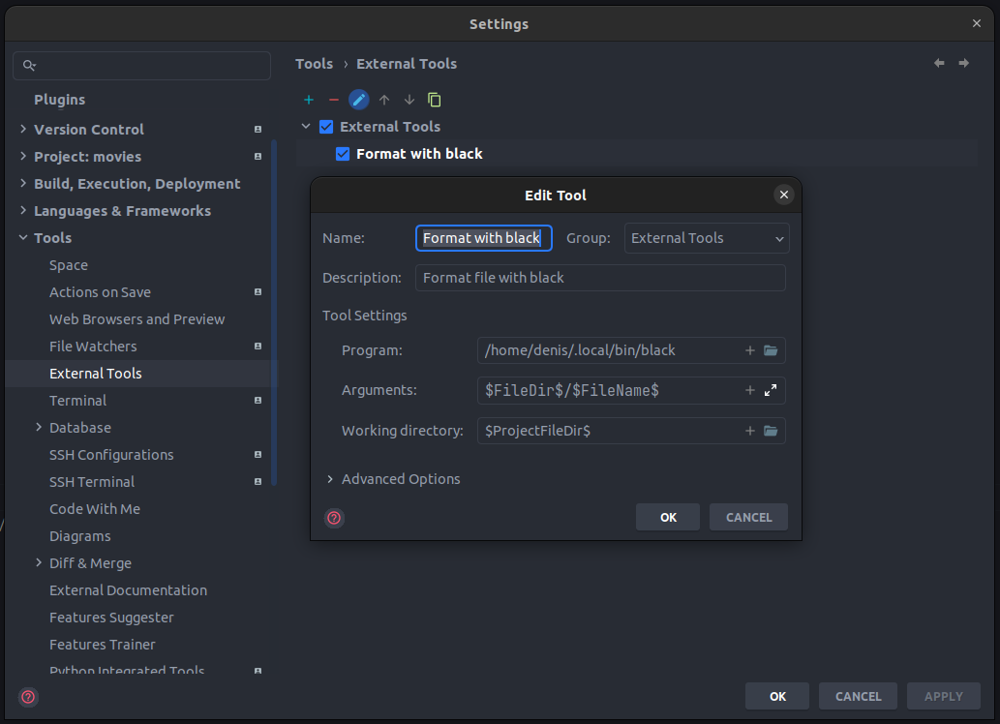

# Форматер и линтер
В качестве форматера мы используем [black](https://github.com/psf/black).
Конфиг black см. в файле `pyproject.toml` в секции `[tool.black]`.

Линтер - flake8, конфиг находится в файле `setup.cfg`.

Если ты используешь PyCharm, то можешь настроить форматирование файла с помощью black
через External Tools:

Также можно повесить на это действие hot key:

