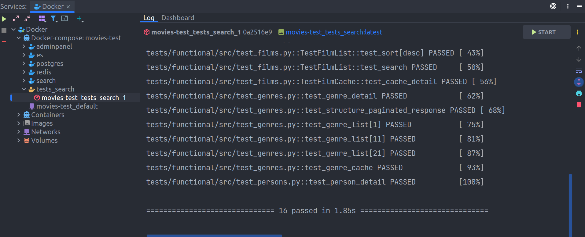

# Запуск тестов
Тесты можно запускать в двух режимах: интерактивно и в режиме демона.
Запускать тесты в режиме демона удобно для отладки: ты можешь подключить сервис Docker в PyCharm,
запустить тесты, изменить код теста и перезапустить контейнер с тестами с помощью PyCharm
(кнопка Start справа вверху) - это не затронет твой терминал и не нужно будет
выполнять лишние команды:


## Запустить тесты в режиме демона
=== "Make"

    <div class="termy">

    ```console
    $ make test

    ---> 100%
    Creating movies_auth-test_postgres_1  ... <span style="color: green;">done</span>
    Creating movies_auth-test_jaeger_1    ... <span style="color: green;">done</span>
    Creating movies_auth-test_redis_1     ... <span style="color: green;">done</span>
    Creating movies_auth-test_app_1       ... <span style="color: green;">done</span>
    Creating movies_auth-test_tests_app_1 ... <span style="color: green;">done</span>
    Creating movies_auth-test_nginx_1     ... <span style="color: green;">done</span>
    ```

    </div>

=== "Native"

    <div class="termy">

    ```console
    $ docker-compose -f docker-compose.yml -f docker-compose.test.yml -f docker-compose.test.dev.yml up -d --build

    ---> 100%
    Creating movies_auth_postgres_1     ... <span style="color: green;">done</span>
    Creating movies_auth_jaeger_1       ... <span style="color: green;">done</span>
    Creating movies_auth_redis_1        ... <span style="color: green;">done</span>
    Creating movies_auth_app_1          ... <span style="color: green;">done</span>
    Creating movies_auth_tests_app_1    ... <span style="color: green;">done</span>
    Creating movies_auth_nginx_1        ... <span style="color: green;">done</span>
    ```

    </div>

## Посмотреть логи тестов
=== "Make"

    <div class="termy">

    ```console
    $ make test-logs s=tests_app
    ```

    </div>

=== "Native"

    <div class="termy">

    ```console
    $ docker-compose -f docker-compose.yml -f docker-compose.test.yml logs tests_app
    ```

    </div>


## Запустить тесты интерактивно
При запуске тестов интерактивно, логи будут выведены в терминале.
Запуск тестов интерактивно с помощью `make`:
<div class="termy">

```console
$ make test-it
```

</div>

Для запуска тестов интерактивно без `make`, нужно сначала сбилдить образы, а затем запустить
контейнер с тестами.

Сбилдить образы:
<div class="termy">

```console
$ docker-compose -f docker-compose.yml -f docker-compose.test.yml build
```

</div>

Запустить тесты:
<div class="termy">

```console
$ docker-compose -f docker-compose.yml -f docker-compose.test.yml run tests_app
```

</div>

## Остановить запущенные контейнеры тестов
=== "Make"

    <div class="termy">

    ```console
    $ make test-stop
    ```

    </div>

=== "Native"

    <div class="termy">

    ```console
    $ docker-compose -f docker-compose.yml -f docker-compose.test.yml stop
    ```

    </div>

## Остановить и удалить запущенные контейнеры тестов
=== "Make"

    <div class="termy">

    ```console
    $ make test-down
    ```

    </div>

=== "Native"

    <div class="termy">

    ```console
    $ docker-compose -f docker-compose.yml -f docker-compose.test.yml down
    ```

    </div>

## Проверить конфигурацию тестов
=== "Make"

    <div class="termy">

    ```console
    $ make test-check
    ```

    </div>

=== "Native"

    <div class="termy">

    ```console
    $ docker-compose -f docker-compose.yml -f docker-compose.test.yml -f docker-compose.test.dev.yml config
    ```

    </div>

## Запустить тесты локально
!!!warning
    Для локального запуска тестов необходимо, чтобы были запущены:

    * База данных (сервис `postgres`);
    * Редис (сервис `redis`);
    * Егерь (сервис `jaeger`).
Для корректного прохождения тестов, нужно чтобы были применены все миграции:
```bash
export FLASK_APP=manage.py
cd src
python -m flask db upgrade
```
Для запуска тестов, выполни следующую команду, из корневой директории проекта:
<div class="termy">

```console
$ pytest src

... test_empty_data <span style="color: green;">PASSED</span>      <span style="color: green;">[  5%]</span>
... test_wrong_data <span style="color: green;">PASSED</span>      <span style="color: green;">[ 11%]</span>
...
... test_new_user <span style="color: green;">PASSED</span>        <span style="color: green;">[100%]</span>
```

</div>
